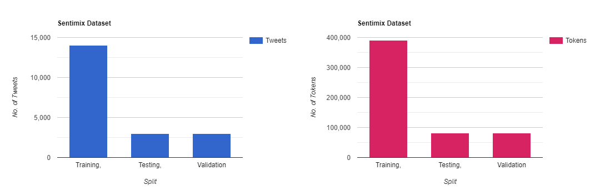
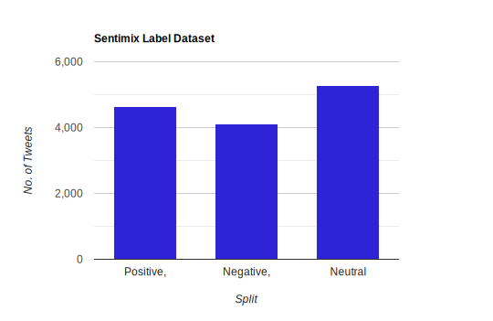
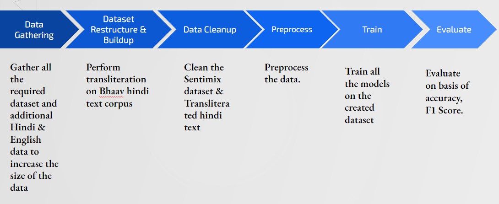

# CS521: Statistical Natural Language Processing Project

### Team Members -
Name: Samihan Nandedkar (667142409)  
Name: Sambhav Jain ()

 
 

# Problem Statement:
THe aim of this project is to develop a robust sentiment analysis system that can accurately analyze the sentiment of Hindi-English code-mixed text. The system needs to overcome several challenges, including the presence of code-mixed language, language ambiguity, and lack of labeled data for training. The system should be able to handle variations in the use of Hindi and English languages, such as different scripts (Devanagari and Roman), grammatical structures, and transliterated words.

## Motivation
The major driving factors to pursue this project are as follows
- India is a linguistically diverse country with a large population that uses both Hindi and English languages extensively in their day-to-day communication. Code-mixed text is a common way for people to convey their thoughts and feelings, which is indicative of India's dynamic language use. In order to meet the multilingual demands of the Indian population, businesses, governments, and scholars can benefit from knowing the mood of Hindi-English code-mixed text.
- Social media platforms are frequently utilized to convey ideas, feelings, and sentiments through text that has been code-mixed. Monitoring social media, analyzing trends, and tracking user sentiment can all benefit from analyzing the sentiment of code-mixed text. Understanding user feelings in other types of user-generated material, such reviews, comments, and feedback, can also be helpful.
- Sentiment analysis on Hindi-English code-mixed text can help businesses and brands monitor the sentiment of their products, services, or brand reputation among the Hindi-English bilingual audience. It can offer insights into client thoughts, grievances, and feedback, assisting businesses in making wise choices to enhance their products and customer satisfaction.

## Dataset

- The main code-mixed dataset is Sentimix created by [Patwa et al.](https://arxiv.org/pdf/2008.04277v1.pdf) containing 20k mannually annotated Code-mixed tweets.
- The distribution of the dataset can be seen in the chart shown below

- Additionally the dataset is evenly balanced with following distribution.

- There is a requirement to restructure and clean the data so that models can trained effectively on the data.

- The dataset size was increased by adding manually annotated hindi text which was taken from [Kumar Y et al.](https://arxiv.org/ftp/arxiv/papers/1910/1910.04073.pdf) and annotated english tweets whose number equated to total number of added

- The pre-processing for each dataset file is performed using the `Basic_Data_Preprocessing.ipynb` script and dumped data/final_data/ 

The raw & preprocessed data are placed in the `data` directory of the repository.

## Methodology

### Data Gathering:

- The first step in gathering all the required datasets was to identify the ones which can most aptly be used in our problem.
- In order to increase the size of the data, additional Hindi and English data was be collected and incorporated into the dataset.
- We took BHAAV, a manually labeled corpus of hindi text to increase the size of dataset. 

### Dataset Restructure & Build

- The sentimix dataset was very crudely structured which would have required additional preprocessing before using it in code. 
- To avoid the redundancy of code, we performed additional step of data restructuring to data into a csv.
- This allowed us to directly use pandas dataframe to import the csv and perform necessary preprocessing tasks on the data.

The data restructuring  performed using `textToCsv.py` script

- Additionally to increase the size of dataset, BHAAV text corpus is used. However as the BHAAV dataset had text in Devnagiri script. Using python module `indic-transliteration`, the transliteration for the hindi text is obtained.
- The transliteration of hindi text & their labels are exported into a csv file with similar structure to that of other datasets.

The transliteration of hindi text is performed using `hinToEng.py` script

### Dataset Cleanup

- The first step in dataset cleanup is to validate the data to ensure it is accurate, complete, and consistent.
- The checking for missing values, incorrect formats, inconsistent data types, and other data integrity issues.
- This task includes removing the emoji, special characters from all the datasets.
- This task is perform apart from all the other preprocessing task as initially the tokens are labelled which makes it easier drop the incorrect data entries.

### Preprocess Data

- These steps were performed in preprocessing the data

1. Lowercase the text
2. Remove Null values
3. Stemming
4. Lemmetization
5. Removing English & Hindi stopwords
6. Remove username (words with numbers)
7. Vectorize the data

### Training the model

We have trained following models and evaluated the results.

1. LogisticsRegression
2. Decision Tree
3. Bidirectional LSTM
4. BERT
5. Roberta
6. IndicBERT

### Evaluate

Results

